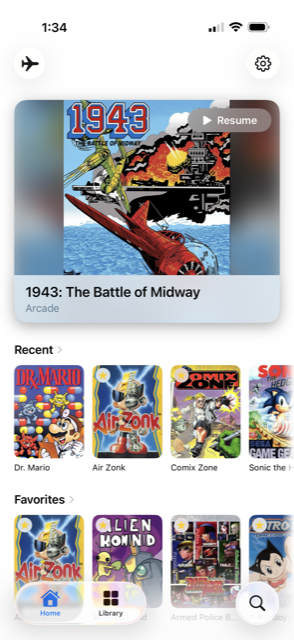
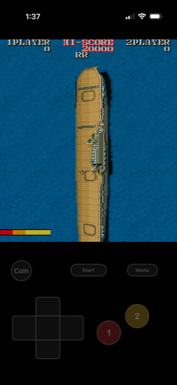
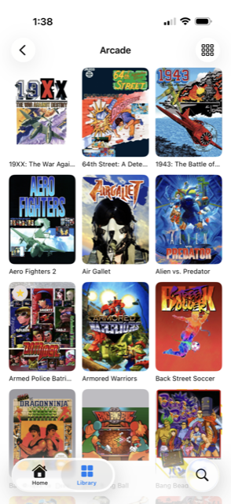
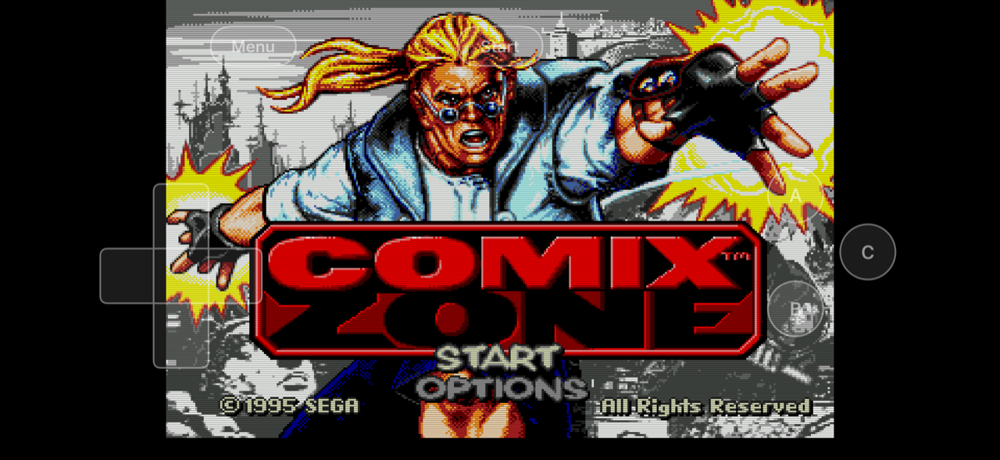

# Cabinet

Your game collection, on your iPhone.

Cabinet plays the games from your own RomM server. It opens on whatever you were
playing last, so you are back in the game in one tap.

| | | |
|:---:|:---:|:---:|
|  |  |  |

## What you get

**Straight back into your game.** No menus to navigate. The app opens where you
left off.

**Controls built for thumbs.** Every console gets its own layout, arranged for
the phone you are holding and the way you are holding it. Diagonals work.
Buttons are easier to hit than they look.

**Your controller just works.** Connect any controller your iPhone supports and
play.

**Play anywhere.** Most systems can be kept on your phone and played with no
signal and no server at all. On a plane, on the subway, anywhere.

**Your saves follow you.** Save states and battery saves go back to your server,
so they are waiting wherever you play next. PlayStation games get their own
memory card.

**The whole screen.** No browser bars, no toolbars. Just the game.

## What you can play

Arcade, PlayStation, Saturn, SNES, NES, Nintendo 64, Game Boy, Game Boy Color,
Game Boy Advance, DS, Genesis, Sega CD, 32X, Master System, Game Gear, PSP,
TurboGrafx-16, TurboGrafx-CD, Neo Geo Pocket Color, Atari 7800, Lynx,
WonderSwan, 3DO and more.

## What you need

- An iPhone running iOS 18 or later
- A RomM server with your games on it

Cabinet was built and tested against RomM 5.1.0. Other versions may work, but
that is the only one it has actually been run against.

Cabinet does not come with any games. It plays yours.

## Get it

Download the latest IPA from
[Releases](https://github.com/MMagTech/cabinet/releases) and install it with
[AltStore](https://altstore.io) or [SideStore](https://sidestore.io).

Or [build it yourself](docs/building.md).

When you first open it, type in your server address and approve it in RomM. That
is all. Cabinet never asks for your password.

## Before you install

I am not a programmer. Cabinet was built with AI assistance, by me, because I
wanted this app to exist and it did not. The entire history is here, unedited,
so you can see how it was made and judge for yourself.

## Licences

Cabinet is MIT. The emulators it uses keep their own licences, listed in
[docs/licenses.md](docs/licenses.md) and in the app under Settings.

Cabinet is free, is not sold, and takes no donations. Some of those emulators
require exactly that, so it stays that way.

Security issues: [SECURITY.md](SECURITY.md).
