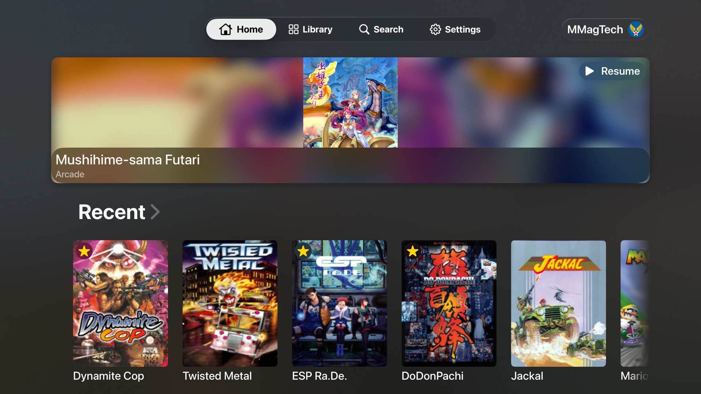
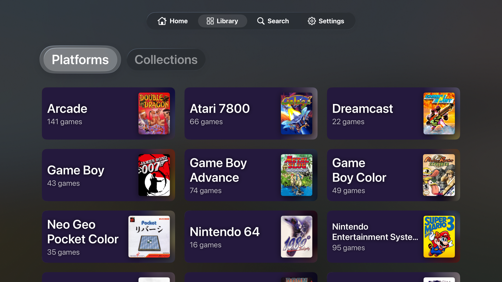
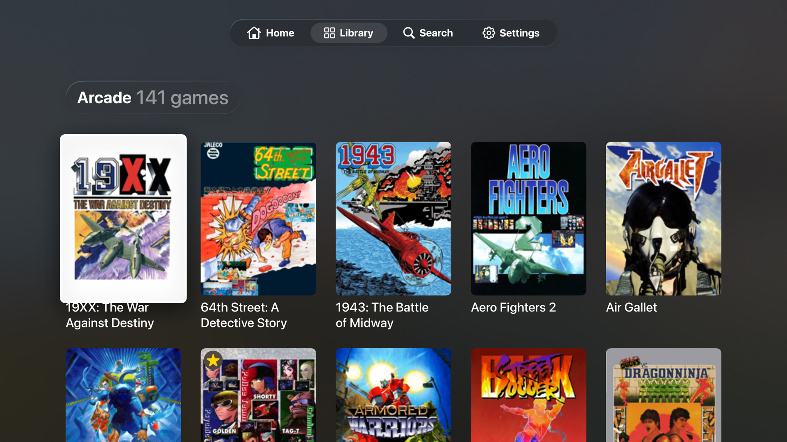
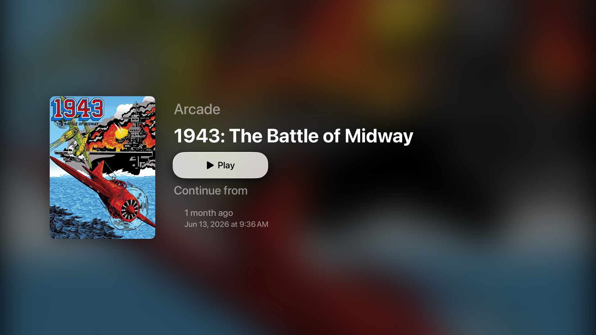

# Cabinet

Your game collection, on your iPhone or your Apple TV.

Cabinet plays the games from your own RomM server. It opens on whatever you were
playing last, so you are back in the game in one tap.

**Latest releases:**
[iOS 0.2.0-alpha](https://github.com/MMagTech/cabinet/releases/tag/v0.2.0-alpha) ·
[tvOS 0.1.0-alpha](https://github.com/MMagTech/cabinet/releases/tag/tvos-v0.1.0-alpha)

| | | |
|:---:|:---:|:---:|
|  |  |  |

| | |
|:---:|:---:|
|  |  |
|  |  |

## What you get

**Real emulation, not a wrapped browser.** Every system on Apple TV, and most
systems on iPhone, run on emulator cores built directly into the app, not a
webview pointed at RomM's own player. Full speed, full screen.

**Straight back into your game.** No menus to navigate. The app opens where you
left off.

**Your controller just works.** Connect any controller your device supports and
play. Pair a second one for couch co-op, no setup required.

**Your saves follow you.** Save states and battery saves go back to your server,
so they are waiting wherever you play next. PlayStation games get their own
memory card.

**The whole screen.** No browser bars, no toolbars. Just the game.

**On iPhone:** controls built for thumbs. Every console gets its own layout,
arranged for the phone you are holding and the way you are holding it.
Diagonals work, buttons are easier to hit than they look. Most systems can be
kept on your phone and played with no signal and no server at all: on a plane,
on the subway, anywhere.

**On Apple TV:** built for the couch, a real controller and ten feet of
distance, not a phone screen made bigger. Nothing to download or manage by
hand: play a game once and it stays cached for next time, quietly reclaimed
only if the system ever needs the space back.

## What you can play

**Native and full speed on both iPhone and Apple TV:** Arcade, PlayStation,
Saturn, Dreamcast, Nintendo 64, SNES, NES, Game Boy, Game Boy Color, Game Boy
Advance, Genesis, Sega CD, 32X, Master System, Game Gear, TurboGrafx-16,
TurboGrafx-CD, Neo Geo Pocket Color, Atari 7800. On iPhone these also work
offline once a game is kept on your phone.

**Everything else your RomM server supports,** DS, PSP, Lynx, WonderSwan, 3DO
and more, plays through RomM's own web player inside the app on iPhone. Those
need a connection. Apple TV has no web player, so if a system is not on the
native list, it does not run on Apple TV yet.

## What you need

- An iPhone running iOS 18 or later, or an Apple TV running tvOS 18 or later
- A RomM server with your games on it

Cabinet was built and tested against RomM 5.1.0. Other versions may work, but
that is the only one it has actually been run against.

Cabinet does not come with any games. It plays yours.

## Get it

Each platform has its own releases on its own schedule, all published under
[Releases](https://github.com/MMagTech/cabinet/releases).

**iPhone:** download the latest iOS IPA and install it with
[AltStore](https://altstore.io) or [SideStore](https://sidestore.io).

**Apple TV:** download the latest tvOS IPA and install it with Xcode from a
Mac, or [build it yourself](docs/building.md). Friendlier install paths are
coming.

When you first open it, type in your server address and approve it in RomM. That
is all. Cabinet never asks for your password.

## Before you install

I am not a programmer. Cabinet was built with AI assistance, by me, because I
wanted this app to exist and it did not. The entire history is here, unedited,
so you can see how it was made and judge for yourself.

## Licences

Cabinet is MIT. The emulators it uses keep their own licences, listed in
[docs/licenses.md](docs/licenses.md) and in the app under Settings.

Cabinet is free, is not sold, and takes no donations. Some of those emulators
require exactly that, so it stays that way.

Security issues: [SECURITY.md](SECURITY.md).
